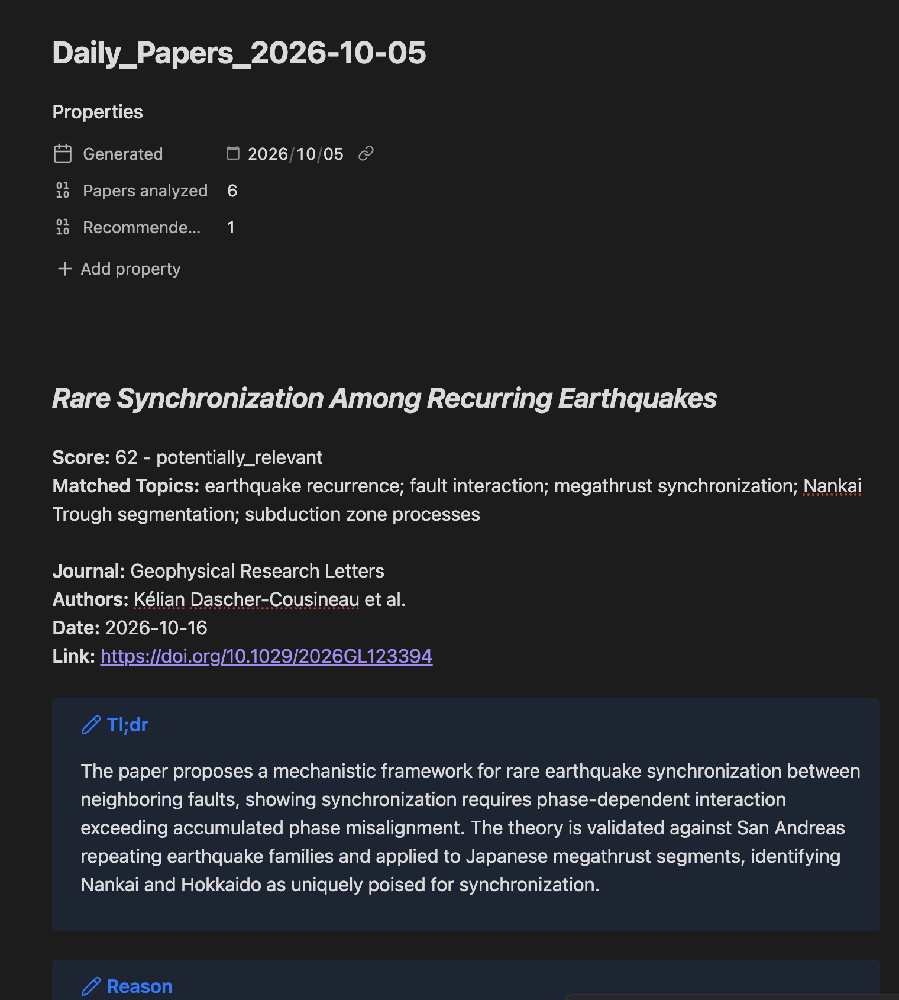

# Paper Monitor

**Turn journal RSS feeds into a focused, profile-based Markdown report.**

Keeping up with new papers should not require opening dozens of journal pages
or reading every abstract in an RSS feed. Paper Monitor runs a repeatable local
workflow that finds new articles, evaluates them against your research profile,
and writes a report containing the papers most relevant to you.

Run it whenever you want an update, or schedule it to create a fresh report
every day. Ready-to-use packages are available for Mac and Windows; you do not
need to install R or enter Docker commands yourself.

## How it works

```text
Journal RSS feeds -> analysis history -> profile-based AI scoring
                  -> recommendation threshold -> Markdown report
```

Each run:

1. Fetches the latest entries available from your selected journal RSS feeds.
2. Skips papers already recorded in the local analysis history, whether or not
   they were previously recommended.
3. Sends the remaining papers to your chosen AI model, up to the configured
   maximum, and evaluates them against your research profile.
4. Saves every successful analysis so the same paper is not analyzed again.
5. Writes papers that meet your recommendation threshold to a dated Markdown
   report. If nothing new qualifies, the report says so.

## Highlights

- **Research-profile filtering** — evaluate papers against a detailed profile,
  not just a single keyword list.
- **Guided profile creation** — describe your work through an AI-guided
  interview, or enter the profile manually.
- **Built-in journal library** — search 50 feeds from AGU, EGU, the Royal
  Society, and selected Springer Earth-science journals, or add your own RSS
  address.
- **No repeated analysis** — successful results are kept in local history and
  deduplicated by DOI on later runs.
- **Useful reports** — each recommendation includes a relevance score, matched
  topics, citation details, a short summary, and an explanation.
- **Flexible AI providers** — use Anthropic, OpenAI, DeepSeek, another
  OpenAI-compatible service, or a local Ollama model.
- **Local files** — settings, analysis history, and Markdown reports remain in
  the extracted package folder.
- **Daily automation** — use Shortcuts on macOS or Task Scheduler on Windows to
  run the same pipeline automatically.

## Quick start

### What you need

- A Mac with Apple Silicon, or a Windows 11 x64 computer
- Docker Desktop, or OrbStack on a Mac
- A few gigabytes of free disk space
- Internet access for journal feeds and online AI services
- An API key for an online AI provider, or a running local Ollama model

A ChatGPT, Claude, or other website/app subscription is not an API key. API
access is a separate service and may be billed separately by its provider.

### 1. Download and extract

Download the package for your computer from the
[latest release](https://github.com/linzhiheng/paper-monitor/releases/latest):

- Mac: `PaperMonitor-...-macos-arm64.zip`
- Windows: `PaperMonitor-...-windows-amd64.zip`

Extract the ZIP and keep its contents together. Do not run the launcher from
inside the ZIP.

### 2. Open the menu and complete setup

Start Docker Desktop or OrbStack. Then open Terminal on a Mac or PowerShell on
Windows in the extracted folder.

Mac:

```bash
chmod +x paper-monitor-macos-arm64.sh
./paper-monitor-macos-arm64.sh menu
```

Windows:

```powershell
.\paper-monitor-windows-amd64.cmd menu
```

The launcher installs the included Paper Monitor image automatically, then
opens the interactive menu. Initial setup guides you through:

1. Choosing an AI provider and testing its connection.
2. Selecting one or more journal feeds.
3. Creating your research profile through an interview or manual entry.
4. Confirming the output folder. Use `/app/output` for the release package.

### 3. Run the pipeline

Mac:

```bash
./paper-monitor-macos-arm64.sh run
```

Windows:

```powershell
.\paper-monitor-windows-amd64.cmd run
```

The launcher closes when the report is ready. Open the `output` folder to find
the generated `Daily_Papers_<date>.md` file.

### Launcher commands

| Command | Purpose |
| --- | --- |
| `menu` | Open the interactive menu to complete setup or change settings |
| `run` | Run one non-interactive monitoring cycle and exit |
| `uninstall` | Remove the installed Paper Monitor image, with an option to keep local data |

## Run automatically

Complete initial setup and test `run` manually before adding a schedule. Always
schedule `run`; `menu` waits for keyboard input.

### Mac: Shortcuts

Create a shortcut with the **Run Shell Script** action, enter the full path to
your launcher, and add a **Time of Day** automation:

```bash
"/full/path/to/paper-monitor-macos-arm64.sh" run
```

Enable **Allow Running When Locked** in the shortcut's privacy settings if that
option is available.

### Windows: Task Scheduler

Create a basic task with your preferred schedule. Choose **Start a program**
and use:

- Program/script: `C:\Windows\System32\cmd.exe`
- Add arguments: `/d /c ""C:\full\path\paper-monitor-windows-amd64.cmd" run"`
- Start in: the extracted Paper Monitor folder

For either system, the computer must be awake and Docker Desktop or OrbStack
must already be running. If you use Ollama, it must also be running. A daily
schedule produces a new report each day without repeating previous analyses.

## Configure Paper Monitor

Run the `menu` command whenever you want to change the workflow.

### Journal feeds

The built-in searchable library contains:

- 24 AGU journals
- 20 EGU journals
- *Philosophical Transactions of the Royal Society A*
- Five selected Springer Earth-science journals

You can enable or remove feeds, search the library, test a feed before saving
it, or add another RSS address manually.

### Research profile

The research profile describes your core, secondary, and emerging interests,
preferred methods and domains, regions, topic aliases, familiar authors and
venues, and positive or negative signals. Paper Monitor can draft it through a
guided interview in English, Chinese, or Japanese, or you can edit its fields
manually.

### AI and output settings

The menu lets you change the provider and model, test the connection, set the
maximum number of new papers analyzed per run, change the recommendation
threshold, and choose the report location and filename prefix.

Online API keys are stored as plain text in `config/llm_config.json` inside the
local package. Keep that file private. Ollama is the built-in option that does
not require an API key.

## Reports and local data

Reports are ordinary Markdown files that work in Obsidian and other Markdown
readers.



Each recommendation can include:

- Title, journal, authors, publication date, DOI, and link
- Relevance score and category
- Topics matched from your research profile
- A short summary of the paper
- An explanation of why it may be relevant

Your persistent files stay next to the launcher:

| Folder | Contents |
| --- | --- |
| `config` | RSS feeds, research profile, AI settings, output settings, and report template |
| `data` | Analysis history used to prevent repeated processing |
| `output` | Generated Markdown reports |

Back up these three folders before replacing or deleting the package.

## Uninstall

Mac:

```bash
./paper-monitor-macos-arm64.sh uninstall
```

Windows:

```powershell
.\paper-monitor-windows-amd64.cmd uninstall
```

The launcher removes the installed Paper Monitor image but keeps `config`,
`data`, and `output` by default. A full cleanup only happens after you request
it and type `DELETE` when prompted. The extracted package folder is never
deleted automatically.

For detailed setup, backup, troubleshooting, and checksum instructions, see the
[full installation and usage guide](release/INSTALL_AND_USAGE.md).

## For developers

Paper Monitor is an R command-line application. `Paper_Monitor.R` is the entry
point, and the layers under `R/` implement RSS ingestion, configuration, LLM
providers, scoring, output, and the interactive CLI.

Build the development image and run one cycle:

```bash
docker compose build
docker compose up --no-build rss-paper
```

Open the interactive menu from a source checkout:

```bash
docker compose run --rm -it rss-paper Rscript Paper_Monitor.R
```

Run the local test suite when R and the required packages are installed:

```bash
sh tests/run_all.sh
```

Release packages are assembled and verified by `scripts/release/build.sh` from
a clean commit whose version matches its Git tag.

## License

Paper Monitor is provided under the repository's
[Internal Use License](LICENSE). Redistribution and public publication require
prior written permission.
